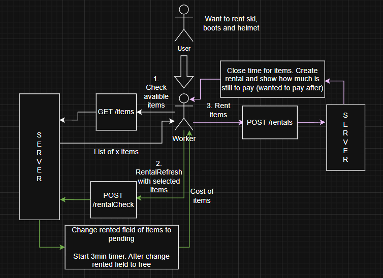

# 1. Ski Rental App

The main purpose of this HLD is to create a system to store, rent and check items.
The worker (user) should be able to add, show, modify, delete items and to create (open and close) rentals. Additionaly user should be able to see rental and maintenance history for each item.

## 1.1 In scoope
 - Add, show, edit and delete items **(worker)**
 - Create and close rentals **(worker)**
 - Creating maintenance history of items
 - Showing items with maintenance out of time

## 1.2 Out of scoope
 - User authorization and authentication
 - User loyalty points and discounts **(client)**
 - Create rentals **(client)**

## 1.3 The Architecture
The system should be created by two standalone applications (frontend and backend) that will comunicate with each other via REST API.
 - Frontend: **TBD**
 - Backend: **TBD**
 - REST API: **OpenAPI Schema**
 - Database: **TBD**

# 2. Components
## 2.1 Frontend
### a) Worker Module
**Item Module:**
- Add new item
- Show single or multiple items (filtered)
- Modify item
- Delete item
- Show history of rental per item
- Show history of maintenance per item
- Show items with last maintenance older that 1 year

**Maintenance Module:**
- Add new maintenance to item
- Show single or multiple maintenances
- Modify maintenance
- Delete maintenance

**Rental Module:**
- Show multiple items (not rented & filtered)
- Add item do cart
- Check items avalibility (itemCheck)
- Create rental
- Modify rental
- Close rental
- Delete rental
### b) User Module
**Out of scoope**
## 2.2 Backend
**/items:**
- (POST) Add new item
- (Get) Get multiple items (filtered)

**/items/{id}:**
- (GET) Get single item
- (PUT) Modify item
- (DELETE) Delete item

**/items/{id}/maintenances:**
- (POST) Add maintenance record for item
- (GET) Get maintenance records for item (paginated)

**/maintenances:**
- (GET) Get multiple maintenance records (filtered)

**/maintenances/{id}:**
- (GET) Get single maintenance record
- (PUT) Update maintenance record
- (DELETE) Delete maintenance record

**/itemCheck:**
- (POST) Check items for rental and put them on pending

**/items/{id}/rentals:**
<!-- - (POST) Add rental record for item -->
- (GET) Get rental records for item (paginated)

**/rentals:**
- (POST) Create rental
- (GET) Get multiple rental records (filtered)

**/rentals/{id}:**
- (GET) Get single rental
- (PUT) Update rental record
<!-- - (DELETE) Delete rental record -->

**/rentals/{id}/close:**
- (POST) Close rental record
## 3. Database Entities

Database Model\

## 4. Typical App Flow

Rental start\

Rental close\

Item check\

## 5. Typical User Side App Flow

One job rental\

Multiple jobs rental\

